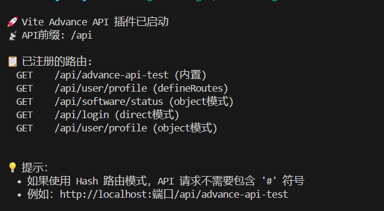

## Vite Advance API 插件

在前端开发中，提高开发效率是每个开发者的目标，尤其是在处理 API 时。尽管市场上已有许多成熟的解决方案，它们往往无法完全满足特定需求。为此，我们开发了一个 **Vite 插件** —— **Vite Advance API**，它旨在简化前端 API 开发，支持多种路由定义方式，并提供统一的响应处理机制。

---

### 安装

您可以通过以下命令来安装该插件：

```bash
npm install vite-advance-api
```

或者使用 `pnpm`：

```bash
pnpm install vite-advance-api
```

---

### 主要特点

#### 1. 内置 `express-async-errors` 库

该插件集成了 `express-async-errors`，使得在编写异步路由时，开发者不需要手动处理 `try-catch`，插件会自动捕获错误并将其传递给错误处理中间件，从而简化代码。

##### 示例：无需 `try-catch`

```js
// 传统方式：每个异步操作都需要写 try-catch
router.get("/data", async (req, res, next) => {
  try {
    // 异步操作
  } catch (error) {
    next(error);
  }
});

// 使用 vite-advance-api 后，可以直接编写异步函数，无需 try-catch
router.get("/data", async (req, res) => {
  // 异步操作
  // 错误会自动被捕获并传递给错误处理中间件
});
```

#### 2. 灵活的路由配置

Vite Advance API 提供了模块化的路由设计，支持通过 `ModuleConfig` 配置多种路由注册方式（如 `object` 和 `direct`）。此外，插件还具备如下特性：

- 支持全局基础路径配置 (`globalBase`)
- 统一的路由定义接口
- 支持所有主要的 HTTP 方法（`GET`, `POST`, `PUT`, `DELETE`）
- 统一的响应处理机制
- 集成常用工具库（如 `lodash`, `axios`, `uuid`）
- 默认支持 CORS
- 内置 `body-parser`（`express.json` 和 `express.urlencoded`）

### 在 Vite 中使用

#### 基础配置

在 `vite.config.ts` 中配置插件时，您可以通过 `setup` 函数提供常用的工具库（如 `lodash`, `axios`, `uuid`），以便更方便地编写路由和处理请求。

```js
// vite.config.ts
import { defineConfig } from "vite";
import { createAdvanceApi } from "vite-advance-api";

// 最简单的用法 - 只启用测试接口
createAdvanceApi();

// 或者完整配置
createAdvanceApi({
  setup: ({ _, axios, uuid }) => [
    {
      type: "object", // 定义路由的类型
      base: "/software", // 模块基础路径
      apis: [
        {
          path: "/status", // 路由路径
          method: "get", // HTTP 方法
          handler: async (req, res) => {
            res.success({ status: "ok" });
          },
        },
      ],
    },
  ],
});

export default defineConfig({
  plugins: [createAdvanceApi()], // 最简单的用法 - 只启用测试接口
});
```

```ts
// vite.config.ts
import { defineConfig } from "vite";
import { createAdvanceApi } from "vite-advance-api";

export default defineConfig({
  plugins: [
    createAdvanceApi({
      prefix: "/api", // 可选，默认为 "/api"
      cors: {
        origin: "*", // CORS 配置
        credentials: true,
      },
      setup: ({ _, axios, uuid }) => [
        // 在此定义你的路由...
      ],
    }),
  ],
});
```

#### setup函数介绍

setup函数的形参为utils对象，包含以下属性：

- router: express的router对象
- app: express的app对象
- express: express对象
- uuid: 生成uuid的函数
- \_: lodash对象
- axios: axios对象

因为在setup函数中 可以拿到已经实例化好的app和express和router对象，这也意味着可以使用更加简单的方式 来调用接口

```js
createAdvanceApi({
  setup: ({ app, express }) => {
    // 可以直接配置 app
    app.use(express.static("public"));
    // ... 其他配置
  },
});
```

setup函数返回一个模块配置数组，每个模块配置包含以下属性：

- type: 模块类型，可选值为`object`或`direct`
- base: 模块基础路径
- apis: 路由配置数组

#### 引入插件之后 内置两个路由

访问 `/api/v1/advance-api-test` 即可访问测试路由。



访问 `/api/v1/advance-api-docs` 即可访问文档路由。

---

## 路由定义模式

### 1. 对象模式（`object`）

对象模式适用于路由结构简单、功能明确的 API 定义。通过该模式，可以直观地设置路径、HTTP 方法和对应的处理函数。

```ts
{
  type: "object", // 路由类型
  base: "/software",  // 模块基础路径
  apis: [
    {
      path: "/status", // 路由的具体路径
      method: "get",   // HTTP 方法
      handler: async (req, res) => {
        res.success({ status: "ok" });
      }
    }
  ]
}
```

#### 使用方式

```js
export default defineConfig({
  plugins: [
    createAdvanceApi({
      setup: ({ _, axios, uuid }) => [
        {
          type: "object", // 定义路由的类型
          base: "/software", // 模块基础路径
          apis: [
            {
              path: "/status", // 路由路径
              method: "get", // HTTP 方法
              handler: async (req, res) => {
                res.success({ status: "ok" });
              },
            },
          ],
        },
      ],
    }),
  ],
});
```

### 2. 直接路由模式（`direct`）

此模式适用于需要更加灵活的路由配置，可以直接在 `setup` 函数中注册路由。

```ts
{
  type: "direct", // 路由类型
  base: "/auth", // 模块基础路径
  setup: (router) => {
    // 登录路由
    router.post("/login", async (req, res) => {
      res.success({ token: "xxx" });
    });
  },
}
```

### 3. `defineRoutes` 工具函数

通过 `defineRoutes` 函数，可以直接在 `setup` 函数中定义路由，简化代码结构。

```ts
setup: ({ defineRoutes }) => {
  defineRoutes("/user", [
    {
      path: "/profile",
      method: "get",
      handler: async (req, res) => {
        res.success({ name: "John" });
      },
    },
  ]);
};
```

---

## 完整示例

以下是一个完整的使用示例，展示了如何在插件中定义不同的路由模式及其逻辑。

```js
import { fileURLToPath } from "node:url";
import vue from "@vitejs/plugin-vue";
import vueJsx from "@vitejs/plugin-vue-jsx";
import UnoCSS from "unocss/vite";
import AutoImport from "unplugin-auto-import/vite";
// vite.config.js
import { defineConfig } from "vite";
import vueDevTools from "vite-plugin-vue-devtools";

import { createAdvanceApi } from "vite-advance-api";

// https://vite.dev/config/
export default defineConfig({
  plugins: [
    createAdvanceApi({
      setup: ({ _, axios, uuid, defineRoutes }) => [
        //方式一
        {
          type: "object", // 定义路由的类型
          base: "/software", // 模块基础路径
          apis: [
            {
              path: "/status", // 路由路径
              method: "get", // HTTP 方法
              handler: async (req, res) => {
                res.success({ status: "ok" });
              },
            },
          ],
        },
        //方式二
        {
          type: "direct", // 路由类型
          base: "/", // 模块基础路径
          setup: (router) => {
            // 登录路由
            router.get("login", async (req, res) => {
              res.success({ token: "xxx" });
            });
          },
        },
        //方式三
        defineRoutes("/user", [
          {
            path: "/profile",
            method: "get",
            handler: async (req, res) => {
              res.success({ name: "John" });
            },
          },
        ]),
      ],
    }),
  ],
});
```

---

## 统一响应格式

Vite Advance API 提供了统一的响应格式，确保前后端数据的一致性。

### 成功响应

```ts
res.success(data, message?, code?)
// 示例：
{
  code: 200,
  data: { ... },
  success: true,
  message: "操作成功"
}
```

### 错误响应

```ts
res.error(data, message?, code?)
// 示例：
{
  code: 400,
  data: null,
  success: false,
  message: "操作失败"
}
```

### 无权限响应

```ts
res.denied(data, message?)
// 示例：
{
  code: 401,
  data: null,
  success: false,
  message: "无权限访问"
}
```

---

## 路由管理工具

插件提供了两个实用的路由管理方法：

```ts
setup: ({ getRoutes, printRoutes }) => {
  // 获取所有注册的路由信息
  const routes = getRoutes();
  console.log(routes);

  // 打印格式化的路由列表
  printRoutes();

  return [
    /* 路由配置 */
  ];
};
```

## 配置

```js
interface CreateAdvanceApiOptions {
  /**
   * API 前缀，默认为 `/api`
   * 用于指定所有 API 路由的基础路径。
   */
  prefix?: string;

  /**
   * CORS 配置，默认为 `{ origin: '*' }`
   * 可自定义跨域请求的配置，支持 `origin`, `credentials`, `methods` 等选项。
   */
  cors?: CorsOptions;

  /**
   * `setup` 函数用于定义路由
   * 该函数接收一个工具对象，并返回一个模块配置（或多个模块配置）。
   *
   * @param utils 工具对象，包含了常用工具库和方法，如 `axios`, `uuid`, `lodash` 等
   */
  setup?: (utils: Utils) => ModuleConfig[];
}

```

```js
import { Request, Response, Router } from "express";
import { CorsOptions } from "cors";
import { CommonResponse } from "./response";
import axios from "axios";
import { AxiosInstance } from "axios";

// 自定义请求和响应类型
export interface ApiRequest extends Request {
  // 可以在这里扩展请求类型
}

// 路由处理器类型
export type RouteHandler = (
  req: ApiRequest,
  res: CommonResponse
) => void | Promise<void>;

// 1. 对象模式的类型
export interface ApiConfig {
  path: string;
  method: "get" | "post" | "put" | "delete";
  handler: RouteHandler;
}

export interface ObjectModeModule {
  type: "object";
  base: string;
  apis: ApiConfig[];
}

// 2. 路由组模式的类型
export interface RouteDefinition {
  path: string;
  method: "get" | "post" | "put" | "delete";
  handler: RouteHandler;
}

// 3. 直接路由模式的类型
export interface RouterDefiner {
  get: (path: string, handler: RouteHandler) => void;
  post: (path: string, handler: RouteHandler) => void;
  put: (path: string, handler: RouteHandler) => void;
  delete: (path: string, handler: RouteHandler) => void;
}

export interface DirectModeModule {
  type: "direct";
  base: string;
  setup: (router: RouterDefiner) => void;
}

// 核心工具集合
export interface Utils {
  router: Router;
  uuid: () => string;
  _: {
    pick: <T>(obj: T, paths: string[]) => Partial<T>;
    omit: <T>(obj: T, paths: string[]) => Partial<T>;
    get: (obj: any, path: string, defaultValue?: any) => any;
  };
  axios: AxiosInstance;
  defineRoutes: (base?: string, routes: RouteDefinition[]) => ModuleConfig;
  getRoutes: () => Array<{ method: string; path: string; moduleName?: string }>;
  printRoutes: () => void;
}

export interface CreateAdvanceApiOptions {
  prefix?: string; // 只保留 prefix 配置
  cors?: CorsOptions;
  setup?: (utils: Utils) => ModuleConfig[];
}

// 添加API文档相关的类型定义
export interface ApiDoc {
  title: string; // API标题
  description?: string; // API描述
  params?: Record<string, string>; // 参数说明
  response?: Record<string, any>; // 返回值示例
}

// 模块文档
export interface ModuleDoc {
  name: string; // 模块名称
  description?: string; // 模块描述
}

// 模块类型联合
export type ModuleConfig = ObjectModeModule | DirectModeModule;

```
